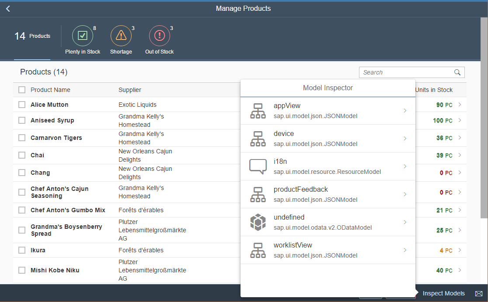

# UI5 Model Inspector (Custom Control)

This custom control exists so that troubleshooting your models is quick and easy. 

The custom control is surfaced as a simple `sap.m.Button` which you can place in your footer (or other location), and launches a `sap.m.ResponsivePopover` when clicked containing all of the models available to the View. After choosing a model, you can drill down into the model's properties. 

### Purpose

Ultimately, you wouldn't want to release this custom control into production applications. So its usage will exist solely in the development and debugging phases of your project. 

### Features planned:

* Edit model properties (including a model refresh button)
* Use proper UI5 controls for editing data (ie. `sap.m.Switch` for booleans)

## Example

> If you want to run the demo locally, please run your HTTP server at the root of this repo. This is required because both the `demo/` folder and the `control/` folder need to be accessible. If ran from within `demo/` then the custom control content cannot be loaded.



## Installation

### Step 1
Add the control directory to the application directory (webapp) of your project (don't forget the `lib/` directory)

### Step 2
Register a module path for the custom control in the init method of your `manifest.json` file:

```
    "sap.ui5": {
        ...
        "resourceRoots": {
            "com.mitchbarry.controls": "../control"
        }
        ...
    }
```

### Step 3
Define the namespace in the top of your view `xmlns:x="com.mitchbarry.controls"`, e.g.:

```
    <mvc:View
	    controllerName="sap.ui.demo.controller.Main"
	    xmlns:html="http://www.w3.org/1999/xhtml"
	    xmlns:mvc="sap.ui.core.mvc"
	    xmlns:x="com.mitchbarry.controls"
	    xmlns="sap.m">
```

### Step 4
And just add: `<x:ModelInspector text="Inspect Models" />` to your view.

### Additional Help
Please see the `demo/` folder of the repository to see how it is used!

## Notes
* The `demo/` application is a marginally modified copy of the ["Manage Products"](https://openui5.hana.ondemand.com/test-resources/sap/m/demokit/tutorial/worklist/07/webapp/test/mockServer.html) UI5 demo application created by the OpenUI5 team.
* README and general notes built on [@jpenninkhof](https://github.com/jpenninkhof)'s [openui5-qrcode](https://github.com/jpenninkhof/openui5-qrcode) control.
* **ModelInspector** will use a `JSONModel` of its own named `__ModelInspector`. If this is not available, the custom control will not properly function. 